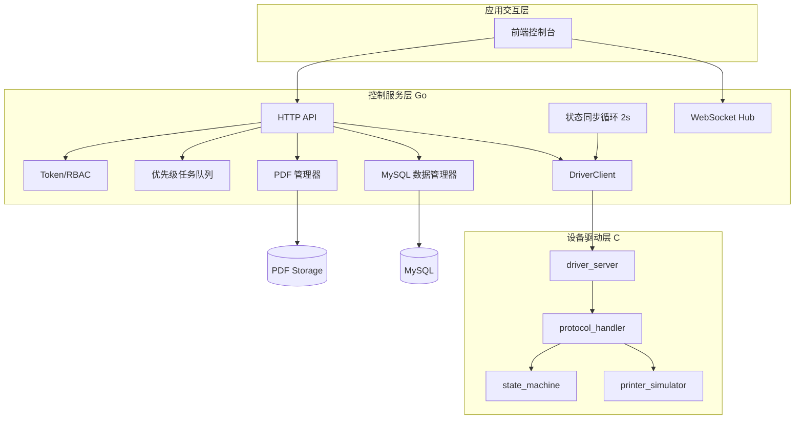
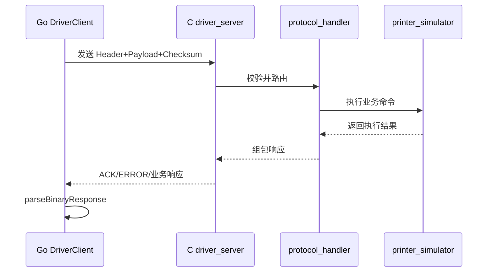
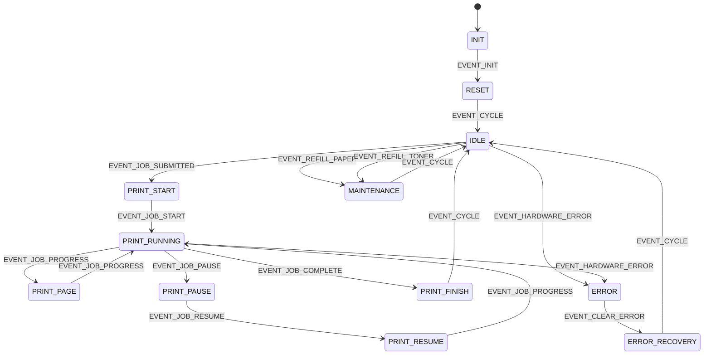
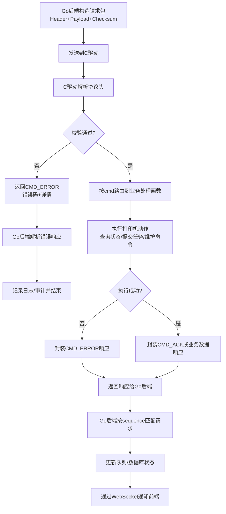

# 网络打印机控制系统架构设计文档

## 1. 文档定位

本文档面向论文写作与工程评审，系统性说明“基于 Go 语言与 C 语言的跨语言通信交互实现”在本项目中的架构设计、实现原理与设计取舍。

文档目标：

- 给出系统总体架构与模块职责划分。
- 解释跨语言二进制协议的结构、校验与兼容机制。
- 阐明驱动状态机与虚拟硬件仿真逻辑。
- 说明一致性、并发、安全与可扩展性设计。

## 2. 总体架构

### 2.1 分层架构

系统采用三层架构：

- 应用交互层（Web 前端 + REST + WebSocket）
- 控制服务层（Go 后端）
- 设备驱动层（C 驱动 + 虚拟打印机）

### 2.2 通道分工

- HTTP：管理面控制（登录、任务管理、维护操作、用户管理）。
- WebSocket：事件实时推送（进度、状态变化、任务事件）。
- TCP 二进制：Go 与 C 之间的设备控制与状态查询通道。

## 3. 后端架构设计（Go）

### 3.1 核心组件

- `PrinterHandler`：聚合业务入口，承接 API 请求。
- `DriverClient`：维护持久 TCP 连接，统一二进制命令收发。
- `TokenManager`：内存令牌生命周期管理。
- `WebSocketHub`：客户端连接与广播。
- `PrintJobQueue`：基于堆结构的优先级队列。
- `MySQLDatabase`：持久化访问层。
- `ProgressTracker`：任务进度事件模型。
- `PDFManager`：文件持久化与索引。

### 3.2 关键流程

1. API 接收请求并做 RBAC 校验。
2. 后端将业务请求映射为驱动命令。
3. `DriverClient` 发送二进制包到驱动并解析响应。
4. 后端更新队列/数据库并通过 WebSocket 广播。
5. 状态同步循环每 2 秒触发查询，维持后端视图一致性。

### 3.3 并发模型

- Go 侧使用 goroutine 处理：
- WebSocket Hub 主循环。
- 周期状态同步循环。
- 每个 WebSocket 连接的读写协程。
- 共享状态通过 `sync.RWMutex` 保护，典型包括：
- Token map
- 任务队列 map + heap
- WebSocket client 集合

## 4. 驱动架构设计（C）

### 4.1 模块职责

- `driver_server.c`：网络服务端、连接管理、粘包处理。
- `protocol_handler.c`：命令路由与业务执行。
- `protocol.c`：协议编解码和校验。
- `state_machine.c`：状态转换与动作绑定。
- `printer_simulator.c`：硬件行为仿真。
- `platform.h`：跨平台线程与网络适配。

### 4.2 运行机制

驱动包含两个核心线程：

- 网络线程：接收请求包，解析并响应。
- 处理线程：每 100ms 执行一次 `printer_process_cycle`。

该机制将“控制面”与“设备行为面”分离，避免单线程阻塞导致状态漂移。

## 5. 跨语言通信原理专章

## 5.1 设计目标

- 保证 Go 与 C 间结构一致、解析一致、语义一致。
- 在可读性和性能之间选择低开销二进制协议。
- 通过固定协议头实现快速分帧与校验。

## 5.2 协议报文结构

统一包格式：

- Header（12 字节）
- Payload（0~65535 字节）
- Checksum（4 字节）

Header 字段定义：

- `magic`：`0xDEADBEEF`
- `version`：`1`
- `cmd`：命令码
- `length`：Payload 长度
- `sequence`：序列号

### 5.3 命令集映射

命令码在 Go 与 C 侧保持一致：

- 状态查询：`0x01`
- 队列查询：`0x02`
- 历史查询：`0x03`
- 提交任务：`0x10`
- 取消任务：`0x11`
- 暂停任务：`0x12`
- 恢复任务：`0x13`
- 补充纸张：`0x20`
- 补充碳粉：`0x21`
- 清除错误：`0x22`
- 模拟错误：`0x23`
- 设置纸仓上限：`0x24`
- 数据传输：`0x30`/`0x31`
- 确认与错误：`0xFE`/`0xFF`

### 5.4 字节序与结构对齐

- 字节序：统一小端序（Little Endian）。
- C 端：结构体使用 `__attribute__((packed))`，避免编译器填充差异。
- Go 端：通过 `encoding/binary` 按字段序列化。

该策略保证跨语言序列化中字段偏移一致，解决了 C/Go 默认内存布局不一致的问题。

### 5.5 校验算法

校验策略在 Go 与 C 侧实现一致：

1. 遍历字节累加。
2. 每步执行 1 位循环左移。
3. 最终与 `PROTOCOL_MAGIC` 进行异或。

表达式可写为：

$$
checksum = \left(\mathrm{ROTL}_1\left(\sum_{i=1}^{n} b_i\right)\right) \oplus 0xDEADBEEF
$$

作用：

- 检测传输破损。
- 防止头部解析后误接收无效数据。

### 5.6 请求-响应模式

### 5.7 通信健壮性设计

- 后端采用“先读 12 字节头，再按长度读 payload+checksum”。
- 驱动端支持缓存累计并处理粘包分包。
- 后端发送失败时会尝试自动重连并重试一次。

### 5.8 设计取舍

采用 TCP + 自定义二进制协议，而非纯 JSON 的原因：

- 更低序列化开销。
- 更稳定字段布局。
- 更适合驱动侧低层语义（状态码、固定结构体）。

代价：

- 可读性低于 JSON。
- 协议调试成本较高，需要严格文档与抓包工具配合。

## 6. 状态机与设备仿真设计

### 6.1 状态机模型

状态机覆盖初始化、空闲、打印、错误、维护、终止阶段。

关键状态示例：

- `STATE_IDLE`
- `STATE_PRINT_RUNNING`
- `STATE_PRINT_PAUSE`
- `STATE_ERROR`
- `STATE_MAINTENANCE`

关键事件示例：

- `EVENT_JOB_SUBMITTED`
- `EVENT_JOB_PROGRESS`
- `EVENT_JOB_COMPLETE`
- `EVENT_HARDWARE_ERROR`
- `EVENT_CLEAR_ERROR`
- `EVENT_CYCLE`

### 6.2 虚拟硬件行为

`printer_simulator` 模拟如下实体：

- 纸张容量与消耗。
- 碳粉百分比与低阈值告警。
- 温度动态变化与上限控制。
- 任务队列与当前任务处理。

每个处理周期可触发：

- 打印进度增加。
- 耗材递减。
- 错误状态转移（缺纸、缺粉、传感器故障等）。

## 7. 数据与持久化架构

### 7.1 数据库选型

当前实现以 MySQL 为持久化后端，负责：

- `print_history`
- `users`
- `audit_log`
- `task_queue`
- `pdf_storage`
- `printer_status_history`

### 7.2 一致性策略

- 任务状态由驱动为主、后端同步为辅。
- 状态同步时将驱动队列映射回后端内存队列，再落库。
- 审计日志独立写入，保证操作追踪完整性。

## 8. 安全架构

### 8.1 认证与授权

- 登录后发放 Token，支持 Header 与 Cookie。
- 用户口令存储采用 bcrypt 哈希。
- API 按角色执行细粒度鉴权。

### 8.2 审计

关键行为写入审计日志：

- 登录/登出
- 任务管理操作
- 用户管理操作
- PDF 查询与下载

### 8.3 当前安全改进空间

- 建议移除硬编码数据库密码，改为环境变量。
- 建议为关键接口增加频率限制与失败惩罚策略。

## 9. 性能与扩展性分析

### 9.1 性能要点

- 二进制协议减少传输与解析成本。
- 驱动网络线程与处理线程分离，提高吞吐稳定性。
- Go 侧并发模型支持多连接 WebSocket 广播。

### 9.2 扩展路径

- 协议层扩展：新增 `cmd` 不破坏现有帧结构。
- 驱动层扩展：可由虚拟设备替换为真实硬件接口。
- 服务层扩展：可将任务队列与状态同步拆分为独立微服务。

## 10. 设计权衡与局限

### 10.1 关键权衡

- 可读性 vs 性能：选择二进制协议。
- 简化部署 vs 配置安全：当前初始实现偏向可快速运行。
- 内存队列速度 vs 崩溃恢复能力：当前队列以内存为主。

### 10.2 已识别局限

- 驱动重连策略仍可增强（指数退避、熔断）。
- 协议版本协商机制可进一步标准化。
- 更细粒度的分布式一致性机制尚未引入。

## 11. 论文映射建议

- 第 3 章（系统架构设计）：使用本文第 2、3、4 章。
- 第 4 章（关键实现）：使用本文第 5、6、7 章。
- 第 6 章（实验与分析）：结合测试文档补充吞吐、延迟、可靠性数据。

## 12. 事实基线与差异说明

### 12.1 事实基线

本文档优先以源码为准：

- `backend/main.go`
- `backend/binary_protocol.go`
- `backend/mysql_database.go`
- `backend/progress_tracker.go`
- `driver/protocol.h`
- `driver/protocol.c`
- `driver/protocol_handler.c`
- `driver/driver_server.c`
- `driver/state_machine.h`
- `driver/state_machine.c`
- `driver/printer_simulator.c`

### 12.2 与历史文档口径差异

历史文档中存在少量版本残留（例如数据库选型描述、旧命令码示例），本文已按当前源码统一并纠偏。后续维护建议遵循“先更新常量定义，再更新说明文档”的版本流程。

