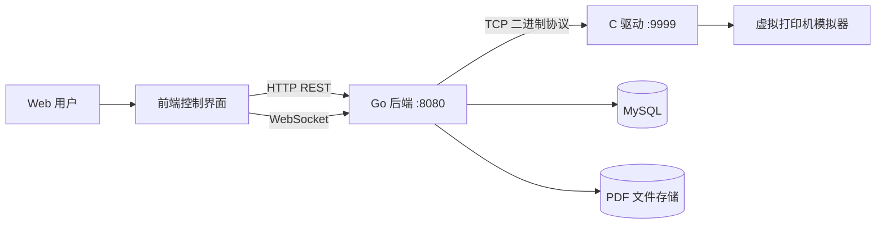
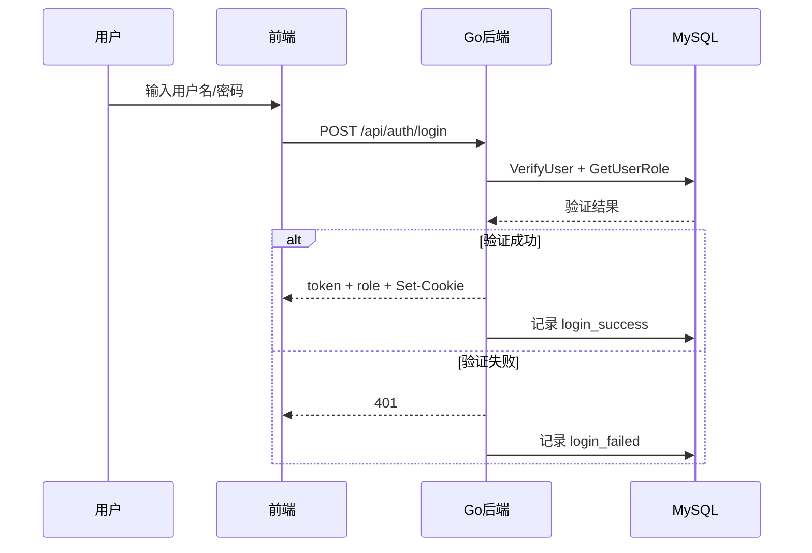
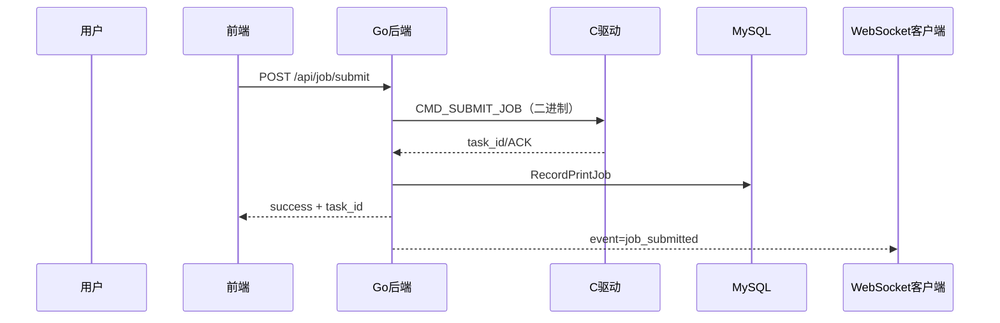
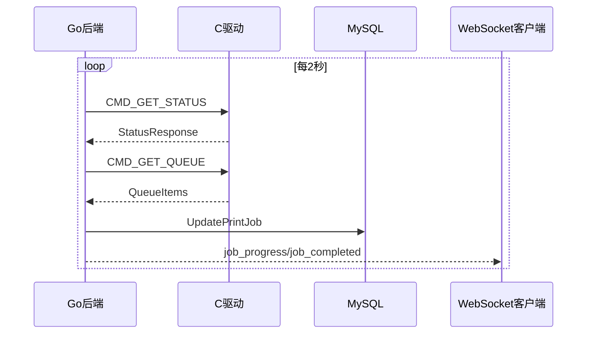
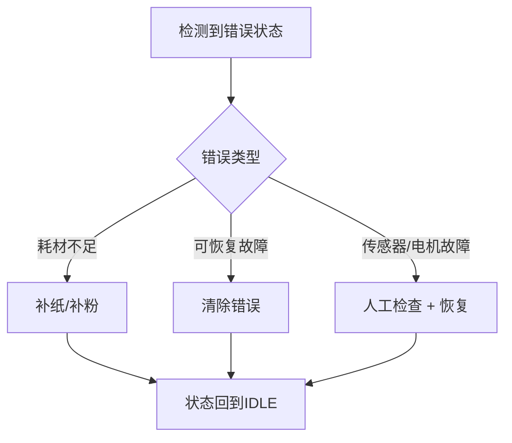

# 网络打印机控制系统产品文档

## 1. 文档目的

本文档面向产品使用者、运维人员和论文评审人员，描述系统的产品定位、功能边界、角色权限、典型业务流程、异常处理与运维规范。文档以当前源码为准，适合作为毕业论文“系统实现与应用说明”材料。

## 2. 产品概述

### 2.1 产品定位

网络打印机控制系统是一个面向局域网环境的打印任务管理平台，采用 Go 后端与 C 驱动协同实现，支持以下目标：

- 统一打印任务入口（提交、取消、暂停、恢复）。
- 实时监控打印机状态（纸张、碳粉、温度、错误码）。
- 提供多角色权限控制（管理员、技术员、普通用户）。
- 提供完整审计链路（登录、操作、历史记录）。
- 支持跨语言二进制协议通信，实现低开销设备控制。

### 2.2 核心业务价值

- 提升打印任务调度效率：支持优先级队列。
- 提升设备可维护性：支持耗材补充、错误模拟与清除。
- 提升可观测性：支持 WebSocket 实时事件推送。
- 提升可追溯性：打印历史、用户操作日志持久化。

### 2.3 系统边界

系统由三层构成：

- 展示层：浏览器页面与前端脚本。
- 控制层：Go 后端，提供 HTTP API 与 WebSocket。
- 设备层：C 驱动服务器与虚拟打印机硬件模拟器。

## 3. 用户角色与权限模型

权限模型采用 RBAC（Role-Based Access Control）。

### 3.1 角色定义

- 管理员（admin）
- 技术员（technician）
- 普通用户（user）

### 3.2 权限矩阵

| 功能 | user | technician | admin |
|---|---:|---:|---:|
| 登录/登出 | Y | Y | Y |
| 查看状态/队列/统计 | Y | Y | Y |
| 提交任务 | Y | Y | Y |
| 暂停/恢复/取消任务 | Y（限本人任务） | Y（限本人任务） | Y（全部任务） |
| 查看打印历史 | Y（限本人） | Y（限本人） | Y（全部） |
| 补充纸张 | N | Y | Y |
| 补充碳粉 | N | Y | Y |
| 清除错误 | Y | Y | Y |
| 模拟硬件错误 | N | N | Y |
| 用户管理 | N | N | Y |
| PDF 历史与下载 | N | N | Y |

## 4. 功能说明

### 4.1 认证与会话

- 登录接口：`POST /api/auth/login`
- 登出接口：`POST /api/auth/logout`
- 令牌机制：后端生成 Token（24 小时有效），可通过 Header 或 Cookie 使用。
- 安全策略：
- 过期 Token 自动清理。
- 登录失败与成功均写入审计日志。

### 4.2 打印任务管理

支持生命周期操作：

- 提交：`POST /api/job/submit`
- 取消：`POST /api/job/cancel`
- 暂停：`POST /api/job/pause`
- 恢复：`POST /api/job/resume`

任务特性：

- 支持 JSON 与 multipart/form-data 提交（可附带 PDF 文件）。
- 支持优先级处理（管理员任务会附加更高优先级偏置）。
- 支持驱动返回 task_id 与后端本地 task_id 回退机制。

### 4.3 设备状态与队列查询

- 当前状态：`GET /api/status`
- 当前队列：`GET /api/queue`
- 系统统计：`GET /api/stats`
- 打印历史：`GET /api/history`

状态数据包含：

- 打印机状态（idle/printing/paused/error/offline）
- 错误代码与错误描述
- 纸张余量、碳粉百分比、温度
- 队列大小、当前任务编号、累计打印页数

### 4.4 维护操作

- 补纸：`POST /api/supplies/refill-paper`
- 补粉：`POST /api/supplies/refill-toner`
- 清错：`POST /api/error/clear`
- 模拟故障（管理员）：`POST /api/error/simulate`

支持模拟故障类型：

- PAPER_EMPTY
- TONER_LOW
- TONER_EMPTY
- HEAT_UNAVAILABLE
- MOTOR_FAILURE
- SENSOR_FAILURE

### 4.5 用户管理

管理员接口：

- 添加用户：`POST /api/user/add`
- 删除用户：`POST /api/user/delete`
- 用户列表：`GET /api/user/list`

输入校验策略：

- 用户名长度 3-32
- 密码长度 8-128
- 角色必须属于 user/technician/admin

### 4.6 PDF 文件管理

管理员接口：

- 最近 PDF：`GET /api/pdf/recent`
- 下载 PDF：`GET /api/pdf/download?task_id=...`

设计说明：

- PDF 存储失败不会阻塞打印任务提交。
- PDF 操作写入审计日志。

### 4.7 实时通知

- WebSocket 地址：`/ws`
- 推送事件包括任务提交、进度更新、任务完成、维护动作等。
- 后端每 2 秒轮询驱动状态并同步任务状态。

## 5. 关键业务流程

### 5.1 登录流程

### 5.2 提交打印任务流程

### 5.3 状态同步流程

### 5.4 故障处理流程

## 6. 运行与部署

### 6.1 运行依赖

- Go 1.16+
- C 编译器（gcc/clang 或 Windows 对应工具链）
- MySQL 8.x
- 现代浏览器

### 6.2 运行顺序

1. 启动 C 驱动服务（监听 9999）。
2. 启动 Go 后端服务（监听 8080）。
3. 打开控制页面访问系统。

### 6.3 初始化行为

后端启动时会：

- 连接 MySQL，必要时自动建库建表。
- 创建默认账号（若已存在则跳过）。
- 初始化 WebSocket Hub、进度追踪器与 PDF 管理器。

## 7. 数据模型（产品视角）

### 7.1 关键业务实体

- 用户（username, role, is_active）
- 打印任务（task_id, filename, pages, status, priority）
- 打印历史（创建时间、完成时间、页数进度）
- 审计日志（user_id, action, details, timestamp）
- PDF 元数据（task_id, file_hash, file_size）

### 7.2 状态语义

任务状态：

- queued
- submitted
- printing
- paused
- completed
- cancelled
- error

打印机状态：

- idle
- printing
- paused
- error
- offline

## 8. 可用性与可靠性设计

### 8.1 可用性

- WebSocket 实时反馈，避免纯轮询模式。
- 任务取消/暂停/恢复支持权限校验。
- 驱动连接断开时支持自动重连并重试一次。

### 8.2 可靠性

- 二进制包强校验（头部校验 + 校验和）。
- 后端读取响应采用“先头后体”完整读取方式，避免粘包/半包解析错误。
- 审计日志覆盖关键操作，便于追责与回溯。

## 9. 运维与排障

### 9.1 常见告警

- 无法连接驱动（9999 不可达）。
- MySQL 初始化失败（账号、端口或服务不可用）。
- 打印机处于 ERROR（缺纸、缺粉、硬件故障）。

### 9.2 排障建议

1. 先检查驱动服务是否启动并监听端口。
2. 再检查后端与数据库连接日志。
3. 对硬件错误先执行补给/清错，再观察状态回归。
4. 通过历史记录与审计日志定位用户操作轨迹。

## 10. 已知限制与改进建议

### 10.1 当前限制

- MySQL 连接参数在启动逻辑中硬编码。
- 打印任务队列主要在内存维护，极端情况下存在重启恢复粒度不足问题。
- 协议版本演进机制当前以固定版本号为主，尚未引入协商策略。

### 10.2 建议方向

- 将数据库与驱动地址改为环境变量配置。
- 增加任务队列持久化快照能力。
- 增强驱动重连策略（指数退避与熔断机制）。
- 补充统一 OpenAPI 文档，提升接口可维护性。

## 11. 与源码一致性的声明

本文档由以下源码与文档交叉校核形成：

- `backend/main.go`
- `backend/binary_protocol.go`
- `backend/mysql_database.go`
- `backend/progress_tracker.go`
- `driver/protocol.h`
- `driver/protocol.c`
- `driver/protocol_handler.c`
- `driver/driver_server.c`
- `driver/state_machine.h`
- `driver/state_machine.c`
- `driver/printer_simulator.c`

若后续代码更新，建议以源码常量定义和路由定义为最终口径。