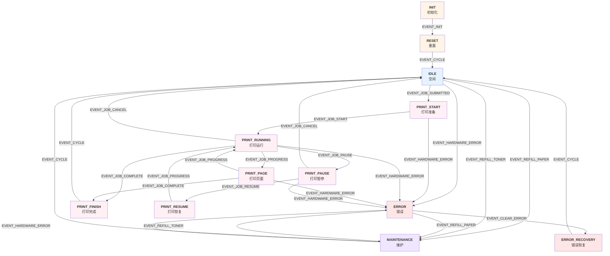
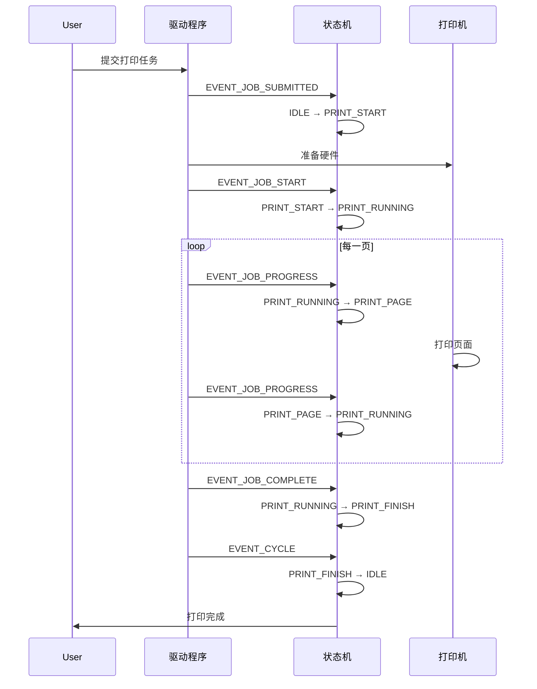
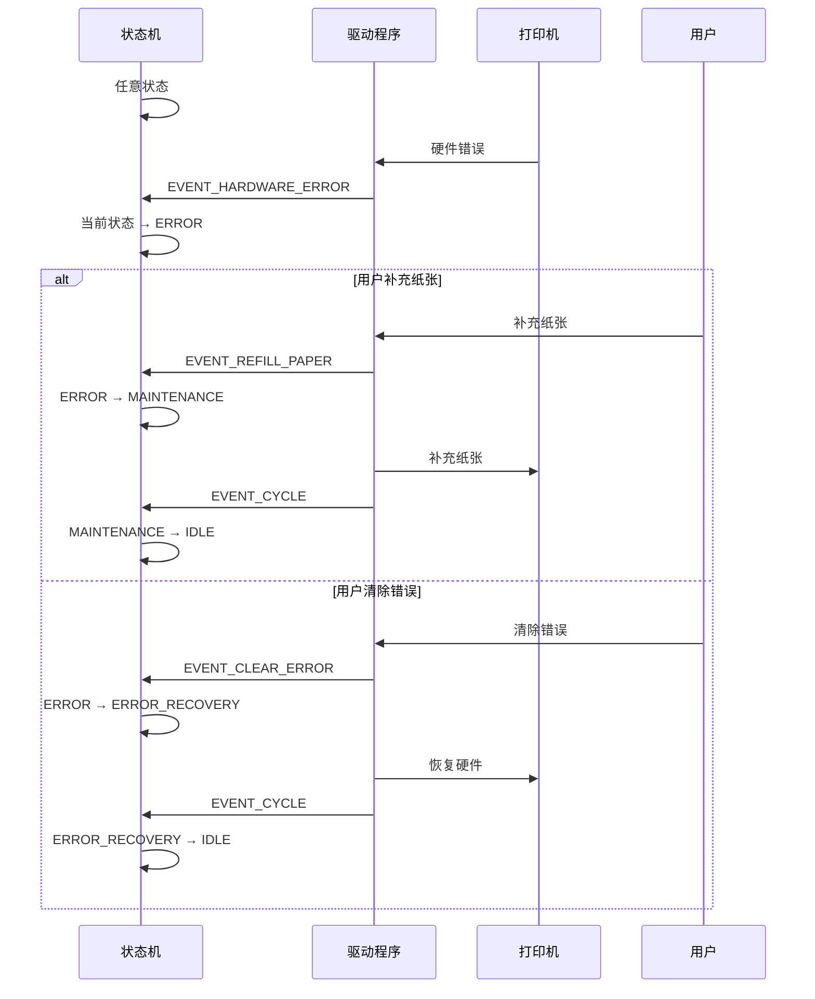

# 打印机驱动状态机转换图

## 概览

本文档描述了网络打印机驱动程序的状态机实现，包括所有状态、事件和转换规则。

---

## 状态机总体流程图



---

## 详细状态转换表

### 1. 初始化流程

| 当前状态 | 触发事件 | 下一状态 | 说明 |
|---------|---------|---------|------|
| **INIT** | EVENT_INIT | RESET | 初始化打印机 |
| **RESET** | EVENT_CYCLE | IDLE | 重置完成，进入空闲状态 |

### 2. 空闲状态（IDLE）

| 当前状态 | 触发事件 | 下一状态 | 说明 |
|---------|---------|---------|------|
| **IDLE** | EVENT_JOB_SUBMITTED | PRINT_START | 收到打印任务 |
| **IDLE** | EVENT_HARDWARE_ERROR | ERROR | 发生硬件错误 |
| **IDLE** | EVENT_REFILL_PAPER | MAINTENANCE | 需要补充纸张 |
| **IDLE** | EVENT_REFILL_TONER | MAINTENANCE | 需要补充碳粉 |

### 3. 打印启动流程（PRINT_START）

| 当前状态 | 触发事件 | 下一状态 | 说明 |
|---------|---------|---------|------|
| **PRINT_START** | EVENT_JOB_START | PRINT_RUNNING | 开始打印任务 |
| **PRINT_START** | EVENT_HARDWARE_ERROR | ERROR | 启动过程中发生错误 |

### 4. 打印运行流程（PRINT_RUNNING）

| 当前状态 | 触发事件 | 下一状态 | 说明 |
|---------|---------|---------|------|
| **PRINT_RUNNING** | EVENT_JOB_PROGRESS | PRINT_PAGE | 进行页面处理 |
| **PRINT_RUNNING** | EVENT_JOB_PAUSE | PRINT_PAUSE | 暂停当前打印 |
| **PRINT_RUNNING** | EVENT_JOB_COMPLETE | PRINT_FINISH | 打印任务完成 |
| **PRINT_RUNNING** | EVENT_JOB_CANCEL | IDLE | 取消打印任务 |
| **PRINT_RUNNING** | EVENT_HARDWARE_ERROR | ERROR | 打印过程中发生错误 |

### 5. 打印页面流程（PRINT_PAGE）

| 当前状态 | 触发事件 | 下一状态 | 说明 |
|---------|---------|---------|------|
| **PRINT_PAGE** | EVENT_JOB_PROGRESS | PRINT_RUNNING | 页面处理完成，继续打印 |
| **PRINT_PAGE** | EVENT_JOB_COMPLETE | PRINT_FINISH | 完成最后一页 |
| **PRINT_PAGE** | EVENT_HARDWARE_ERROR | ERROR | 页面处理中发生错误 |

### 6. 打印暂停/恢复流程

| 当前状态 | 触发事件 | 下一状态 | 说明 |
|---------|---------|---------|------|
| **PRINT_PAUSE** | EVENT_JOB_RESUME | PRINT_RESUME | 恢复打印 |
| **PRINT_PAUSE** | EVENT_JOB_CANCEL | IDLE | 取消暂停的打印 |
| **PRINT_PAUSE** | EVENT_HARDWARE_ERROR | ERROR | 暂停中发生硬件错误 |
| **PRINT_RESUME** | EVENT_JOB_PROGRESS | PRINT_RUNNING | 恢复后继续打印 |

### 7. 打印完成流程（PRINT_FINISH）

| 当前状态 | 触发事件 | 下一状态 | 说明 |
|---------|---------|---------|------|
| **PRINT_FINISH** | EVENT_CYCLE | IDLE | 打印完成，返回空闲状态 |

### 8. 维护流程（MAINTENANCE）

| 当前状态 | 触发事件 | 下一状态 | 说明 |
|---------|---------|---------|------|
| **MAINTENANCE** | EVENT_CYCLE | IDLE | 维护完成，返回空闲状态 |
| **MAINTENANCE** | EVENT_HARDWARE_ERROR | ERROR | 维护中发生硬件错误 |

### 9. 错误处理流程

| 当前状态 | 触发事件 | 下一状态 | 说明 |
|---------|---------|---------|------|
| **ERROR** | EVENT_CLEAR_ERROR | ERROR_RECOVERY | 清除错误，开始恢复 |
| **ERROR** | EVENT_REFILL_PAPER | MAINTENANCE | 补充纸张来解决错误 |
| **ERROR** | EVENT_REFILL_TONER | MAINTENANCE | 补充碳粉来解决错误 |
| **ERROR_RECOVERY** | EVENT_CYCLE | IDLE | 恢复完成，返回空闲状态 |

---

## 事件类型详解

### 系统事件
- `EVENT_INIT` - 初始化系统
- `EVENT_RESET` - 重置系统
- `EVENT_SHUTDOWN` - 关闭系统

### 任务事件
- `EVENT_JOB_SUBMITTED` - 提交打印任务
- `EVENT_JOB_START` - 开始执行任务
- `EVENT_JOB_PROGRESS` - 任务进度更新
- `EVENT_JOB_PAUSE` - 暂停任务
- `EVENT_JOB_RESUME` - 恢复任务
- `EVENT_JOB_CANCEL` - 取消任务
- `EVENT_JOB_COMPLETE` - 任务完成

### 硬件事件
- `EVENT_HARDWARE_ERROR` - 硬件错误发生
- `EVENT_ERROR_RECOVERED` - 错误已恢复
- `EVENT_PAPER_LOW` - 纸张即将用尽
- `EVENT_TONER_LOW` - 碳粉即将用尽
- `EVENT_TEMP_HIGH` - 温度过高

### 用户事件
- `EVENT_REFILL_PAPER` - 补充纸张
- `EVENT_REFILL_TONER` - 补充碳粉
- `EVENT_CLEAR_ERROR` - 清除错误
- `EVENT_MAINTENANCE_MODE` - 进入维护模式

### 定时器事件
- `EVENT_TIMEOUT` - 超时
- `EVENT_CYCLE` - 定期循环事件

---

## 状态分类

### 初始化阶段
- `STATE_INIT` - 初始状态
- `STATE_RESET` - 重置状态

### 空闲阶段
- `STATE_IDLE` - 空闲状态
- `STATE_WARMING_UP` - 预热状态（预留）

### 打印阶段
- `STATE_PRINT_START` - 打印准备阶段
- `STATE_PRINT_RUNNING` - 打印运行阶段
- `STATE_PRINT_PAGE` - 页面处理阶段
- `STATE_PRINT_PAUSE` - 打印暂停阶段
- `STATE_PRINT_RESUME` - 打印恢复阶段
- `STATE_PRINT_FINISH` - 打印完成阶段

### 错误处理阶段
- `STATE_ERROR` - 错误状态
- `STATE_ERROR_RECOVERY` - 错误恢复状态
- `STATE_ERROR_HANDLED` - 错误处理完成状态（预留）

### 维护阶段
- `STATE_MAINTENANCE` - 维护状态
- `STATE_OFFLINE` - 离线状态（预留）

### 终止阶段
- `STATE_TERMINATING` - 终止状态

---

## 打印任务完整生命周期



---

## 错误恢复流程



---

## 关键特性

### 1. 强制转换机制
- 支持通过 `state_machine_force_state()` 强制状态转换
- 用于紧急情况或故障恢复

### 2. 事件缓冲队列
- 最多缓冲 16 个待处理事件
- 按顺序处理事件

### 3. 状态转换行为
- 执行关联的动作函数
- 更新状态进入时间戳
- 记录状态转换历史

### 4. 定期循环事件
- `EVENT_CYCLE` 用于推进状态机
- 在特定状态下自动触发

### 5. 错误恢复路径
- 多条错误恢复路线
- 支持纸张、碳粉补充和手动清除

---

## 使用示例

### 初始化状态机
```c
Printer* printer = printer_simulator_create();
StateMachineContext* sm = state_machine_init(printer);
```

### 发送事件
```c
state_machine_send_event(sm, EVENT_JOB_SUBMITTED);
state_machine_send_event(sm, EVENT_JOB_START);
```

### 处理事件
```c
state_machine_process_events(sm);
```

### 获取当前状态
```c
DriverState current = state_machine_get_state(sm);
printf("Current state: %s\n", state_to_string(current));
```

### 运行状态机循环
```c
state_machine_run_cycle(sm);
```

---

## 统计和监控

状态机上下文记录以下信息：
- `state_changes` - 状态转换次数
- `total_events_processed` - 处理的总事件数
- `error_count` - 发生的错误次数
- `state_entry_time` - 进入当前状态的时间戳
- `event_timestamp` - 最后事件的时间戳

